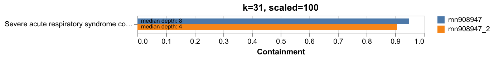

# Knownknowns

> [there are known knowns; there are things we know we know](https://en.wikipedia.org/wiki/There_are_unknown_unknowns)

A workflow for quickly estimating the containment of one or more genomes in a FASTQ file. Plots and outputs containment values in CSV format. Control *k*-mer length (default 31) with `--kmer`.

## Requirements

- Nextflow (>= 22.0)
- Conda or Docker

## Usage

### Default (uses conda)

```bash
nextflow run main.nf \
    --references test/data/mn908947.fa \
    --reads test/data/mn908947.fastq.gz \
```

### Docker

```bash
nextflow run main.nf \
    --references test/data/mn908947.fa \
    --reads test/data/mn908947.fastq.gz \
    -profile docker
```

### Signature input

`--reads` and `--references` both also accept presketched Sourmash sketches (`.sig`) created with `sourmash sketch`.

## Outputs

- `containment.csv` - Containment results
- `containment.png` - Bar chart of containment by ref sequence

**Example plot**

