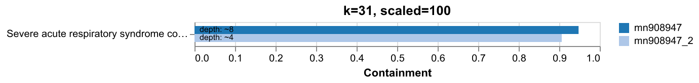

# Knownknowns

> [there are known knowns; there are things we know we know](https://en.wikipedia.org/wiki/There_are_unknown_unknowns)

A workflow for quickly estimating the containment of sequences in a fasta file (`--references`) in either a single FASTQ file or a directory of FASTQ files (`--reads`). Outputs containment values in CSV format and plots them. Specificy *k*-mer length with `--kmer`  (default 31) and sketch resolution with `--scaled` (default 100).

## Requirements

- Nextflow (>= 22.0)
- Conda or Docker

## Usage

### Default (uses conda)

```bash
nextflow run main.nf \
    --references test/data/mn908947.fa \
    --reads test/data/mn908947.fastq.gz \
```

### Docker

```bash
nextflow run main.nf \
    --references test/data/mn908947.fa \
    --reads test/data/mn908947.fastq.gz \
    -profile docker
```

### Signature input

`--reads` and `--references` both also accept presketched Sourmash sketches (`.sig`) created with `sourmash sketch`

## Outputs

- `containment.csv` - Containment results
- `containment.png` - Bar chart of containment by ref sequence

**Example plot**

